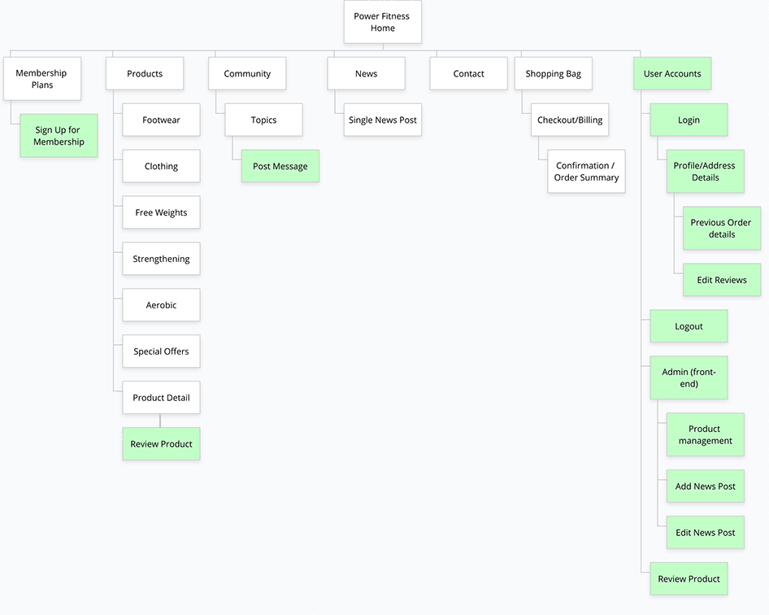

# Milestone 4 - Power Fitness Gym - by Kevin Bourke


Power Fitness Gym is a website where users can search for and purchase fitness products via text search or categories. Users can create an account to save delivery information for future use, review their orders and logged in users are also able to leave reviews on products.

A user can also subscribe to one of 2 gym memberships, Gold and Platinum. Then the user can have access to the gym, and if they choose the Platinum membership they will get more benefits like workout and nutrition plans. In real world use, there would need to be some administration done on the gym's side, such as organising a key card for new members, creating and updating workout and nutrition plans, as well as the classes timetable.

Logged in users can also post short messages on a community message board, where they can post a topic for conversation and can respond to other users queries.

Gym staff members (with the appropriate access) can add, edit and delete products, and create news posts for keeping their members up to date with latest information.

The live deployed site can be found here - https://power-fitness.herokuapp.com/

## Research

I researched numerous gym and eCommerce websites for inspiration for site structure, features and style. A list of the most relevant inspiring sites can be found at the bottom of this document [here](#Design-and-Research). 

I also found a couple of very interesting case studies for designing an eCommerce store, one for a [sporting goods](https://medium.com/swlh/designing-my-first-e-commerce-website-ux-case-study-9c1cd1a9a95) website and another for a [toy store](https://uxdesign.cc/designing-an-e-commerce-site-for-a-toy-store-a-ux-case-study-d244f891d028) site. These gave some great insight into how a professional team of UX designers would approach designing an eCommerce website, from the brief all the way through to layout wireframes.

I tried to keep all of what I liked or learned in mind while going through the following UX process.

## UX

I wanted the site to have the following main overarching features.
 - [x] Users should be able to browse by category or search the site for products.
 - [x] Users should be able to purchase these products.
 - [x] If they like, users should be able to register and login to the site.
 - [x] Users should have the option to sign up for and manage their gym membership.
 - [x] Users can review products.
 - [x] Users can update other members on their successes.

### User Stories

This section provides insight into the UX process, focusing on who this website is for, what it is that they want to achieve and how this project is the best way to help them achieve these things. It expands on the main features as were listed above. There are quite a lot of different user stories, depending on whether the user is a casual shopper, a Gym Member or the Store owner/manager. Instead of writing this list here, I have linked to a spreadsheet of User Stories that I created to guide the development and help me make sure all the functionality was addressed. You can see this in the spreadsheet below:

[User Stories Spreadsheet](https://docs.google.com/spreadsheets/d/1crRy0zZcZ_VDK97j8zLyTicSSnBYAvQEznwdIqWQYkI/edit?usp=sharing)

#### As a developer

I include this here to explain what I, as a developer, wanted to get out of this project. 

 - To provide an easy to use, online fitness shop, which and provides the shop owner with full CRUD functionality on products.
 - To improve my knowledge of Python and Django with a practical project.
 - To learn about Stripe and webhooks.
 - To learn more about passing data from the front-end to the back-end and vice-versa, using AJAX and JSON. 
 - To learn to deploy the web app through Heroku, and store media on Amazon Web Services.
 - Using a virtual environment on a local computer.

### Strategy

The goals of this type of website are to:

1. Be a source of information about the gym, opening times, location, membership costs etc.
2. Allow users contact the gym with any queries.
3. Be a source of decent gym accessory products for gym users, and the public in general.
4. Allow users leave reviews of products.
5. Create a small online community of gym users who can post messages and discuss things with other gym users.
6. Allow users sign up for a gym membership, and upgrade or cancel their membership.
7. To create an additional online income stream for the gym owners, through selling products and memberships.
8. To give staff members the ability to add new products.
9. To give admins full control in the back-end over everything that may be posted or created by users or staff.

### Scope

This section determines what the users should be able to do on the website. Users should be able to:

- [x] Browse products by text search.
- [x] Browse products by category.
- [x] View total in their shopping bag.
- [x] Register, login, logout.
- [x] Save a profile.
- [x] Review products, and manage their reviews.
- [x] Purchase products securely.
- [x] Subscribe to memberships securely, and upgrade or cancel their membership.
- [x] Post messages to other users, and manage their messages.

Staff Users should be able to do all the above and:
- [x] Add, edit or delete a product.
- [x] Post, edit or delete news updates for the gym.
- [x] Mark a product as a Best Seller.
- [x] Put products on sale with a separate sale price.

### Structure

To list the pages I needed and to visualise the site structure, I designed my visual sitemap in Gloomap. In the sitemap below, the pages marked in green represent site User (logged in) pages:



I also listed out the features I wanted on the homepage:

- Obvious signposts to Products and Membership.
- Show a few Best Selling products, that actually can be selected by the Staff or admin.
- Show openming hours.
- Show a location map.
- Have links to Social media accounts.
- Have easy access to Delivery, Return, Guarantee and Payment policies to instill confidence in customers.

### Skeleton

I sketched up some very rough ideas on paper and then designed the final wireframes, which were created in Balsamiq:

- [Home page on desktop wireframe](README_resources/wireframes/homepage-desktop.png)
- [Home page on mobile wireframe](README_resources/wireframes/homepage-mobile.png)
- [Mobile navigation wireframe](README_resources/wireframes/mobile-nav-open.png)
- [Membership page on desktop wireframe](README_resources/wireframes/membership-desktop.png)
- [Membership page on mobile wireframe](README_resources/wireframes/membership-mobile.png)
- [Products page on desktop wireframe](README_resources/wireframes/products-desktop.png)
- [Single product page on desktop wireframe](README_resources/wireframes/product-single-desktop.png)
- [Single product page on mobile wireframe](README_resources/wireframes/product-single-mobile.png)
- [Shopping bag page on desktop wireframe](README_resources/wireframes/shopping-bag-desktop.png)
- [Shopping bag page on mobile wireframe](README_resources/wireframes/shopping-bag-mobile.png)
- [Checkout page on desktop wireframe](README_resources/wireframes/checkout-desktop.png)
- [Checkout page on mobile wireframe](README_resources/wireframes/checkout-mobile.png)
- [Community Message Board page on desktop wireframe](README_resources/wireframes/community-message-board-desktop.png)
- [Community Topic Posts on desktop wireframe](README_resources/wireframes/community-posts.png)

### Surface

This is the sensory design section of a website, or how it looks, feels and sounds. I wanted the design to be . I created a moodboard with Adobe Spark from research of colours, styles and components to visually illustrate the style I wished to pursue. You can see that [moodboard here.](README_resources/mood-board.png)

I decided my main colour would be orange. Orange is about creativity, enthusiasm, energy and youth according to this [99designs article](https://99designs.ie/blog/tips/color-psychology/). Similarly [this article about the psychology of orange](https://www.rcwilley.com/blogs/Room-To-Talk/34/2017/10/7197/Color-Psychology-Orange-and-Black) also says it's energetic, happy and is associated with celebrations, and stimulation. It is a strong colour that pops and is great for drawing the eye to things like buttons or headings.  I also like how the orange, black and white worked together on [Ben Dunne Gyms](https://www.bendunnegyms.com/), though I would probably want to use a lot more white, so it would not seem like a Halloween theme.

I searched Shutterstock for a gym logo wth orange, and there were a number of logos that used orange and black, from experience fitting a vertical logo into a header can be tricky if you don't want the header to be too tall. With this in mind I chose the power fitness logo which has the logo text horizontal and to the right.

I like how [Planet Fitness](https://www.planetfitness.com/gyms/manhattan-27th-st-ny) used their bright complementary colours of purple and yellow, along with light and dark greys. I researched colour combinations, particularly looking for orange and another cooler complementing colour, which would most likely be a shade of blue. I used [Adobe Color](https://color.adobe.com/create/color-wheel) and set the logo orange in the middle and used the 'Complementary' colour harmony rule to determine the other colours. This gave me my complementary blue colours:


I did not think I would need the additional orange colours so I brought the main orange and the complementary blues into [Coolors](https://coolors.co/), and added a dark grey and a light grey. Along with white and black these would be my colours. Coloors generates a nice pdf palette with lots of different shades of those colours.

This was my final palette:


You can also see it completely in [PDF format here](README_resources/colour-palette-power-fitness-gym.pdf).

#### Fonts

On all the gym and shop websites I researched, I liked the font used on [Ben Dunne Gyms](https://www.bendunnegyms.com/westpoint.aspx) as a heading, as it is strong and bold. 
This [canva article](https://www.canva.com/learn/the-ultimate-guide-to-font-pairing/) also shows a very bold heading font to help represent Sports or Activity (under 03. Sports/active), which is a Google Font called [Archivo Black](https://fonts.google.com/specimen/Archivo+Black), and there is also an [Archivo Narrow](https://fonts.google.com/specimen/Archivo+Narrow) which I thought might work well as a secondary heading. Google fonts has suggestions for pairing fonts, and from those I decided on Source Sans Pro, which is a good sans-serif font for body text, as it is easy to read at smaller sizes.

### Stripe Checkout Functionality

I mapped out in a visual diagram, the process for checkout via Stripe. I have tried to show how data gets passed between Stripe, the views and the webhook handler, and how it is stored in the database. While this is quite broad strokes and lacks a lot of detail, it helped me understand the checkout process much better. Checkout starts when the form is submitted on the /checkout/ page (so starts at checkout.html template). You can see a [pdf of the checkout process here](README_resources/checkout-process-map.pdf) or see an image of it below:


### Database Schema

Based on the functionality required and the data to be stored, I created my database structure. Most of the tables have some relationship to the User table, as the user generally creates items from the other tables, such as Orders, Product Reviews and community messages. 

You can see a [pdf of the database schema here](README_resources/checkout-process-map.pdf) or see an image of it below:


### Defensive Design

An important part of UX is making sure users cannot cause errors, and that they get positive useful feedback if they try to perform an action that they are not allowed to. This includes things like:
 - A user cannot break the site (or cause an error appear on screen), by pressing buttons out of expected order, or using browser forward and back buttons.
 - Required Form inputs give warnings or feedback if not filled, or filled correctly.
 - A user is given feedback if they are not allowed to do something, like register an already existing username.
 - A custom '404 page not found' page.
 - Ensure that all orders are entered into our database even in the event of a user error during the checkout process. If the payment form is not submitted for some reason like a user closes the page before the payment is complete, the webhook handler will have this information and create the order in the database.

## Technologies Used

### Languages and Frameworks
1. HTML
2. CSS
3. Javascript 
4. Python
5. [Django Framework](https://docs.djangoproject.com/en/3.1/)
6. [PostgreSQL Database](https://www.postgresql.org/)
7. [Heroku hosting platform](https://heroku.com)
8. [Bootstrap Framework](https://getbootstrap.com/)
9.  [Font Awesome](https://fontawesome.com/)
11. Google Fonts
12. [JQuery](https://jquery.com) - The project uses **JQuery** to simplify DOM manipulation, and animation of certain elements.
13. [RealFaviconGenerator](https://realfavicongenerator.net/) - to quickly generate favicons for all browsers.
    

### Tools Used
1. [VS Code](https://code.visualstudio.com/) and [Brackets](http://brackets.io/) code editors.
2. [Git](https://git-scm.com/) - Installed on local devices and integrated with VS Code and Brackets, to allow version control.
3. [GitHub](https://github.com/) - Used a repository for the project files and previous versions. Also used to deploy the website.
4. [Balsamiq](https://balsamiq.com/) - Used for creating wireframes for different variations and different screen sizes.
5. I used Photoshop and Illustrator for image and svg manipulation.
6. [TinyPNG](https://tinypng.com/) - To keep transparent png sizes to a minimum I used the online png compressing service [TinyPNG](https://tinypng.com/), as well as the desktop application.
7. [Coolor](https://coolors.co/) - Used top help determine the colour scheme.
8. [Gloomaps](https://www.gloomaps.com/) - For creating my sitemap.
9. [ngrok](https://ngrok.com/product) - For testing Stripe webhooks when working locally


## Features
 
### Existing Features

#### The ability to browse/search by product categories that are on the website.


#### The ability to search Products by text keyword. 


#### Users can register a profile on the site.


#### Users can login and logout of the site.

#### When logged in users get addition options in the navigation.


#### Logged in users can change their password.

#### Logged in users can manage categories (but not ).


#### Minor Features

##### Back to top (of page) button

Expand the sections below for more info on details:

<details>
  <summary><strong>Responsive images</strong></summary>


</details>


<details>
  <summary><strong>Skip to main content</strong></summary>

 There is a 'Skip to main content' link just inside the body tag for accessibility for screen readers. The main content is not usually the first thing on a web page. Keyboard and screen reader users generally must navigate a long list of navigation links, sub-lists of links, corporate icons, site searches, and other elements before ever arriving at the main content. This is then hidden from view with the class 'sr-only', however when it receives focus from keyboard it becomes visible. This is based on accessibility recommendations from https://webaim.org/techniques/skipnav/. This can be checked by pressing tab when a pages loads, and then pressing tab again should show the next focused element is on the page content and not the logo or navigation.

 </details>

### Features to consider implementing in the future

 - Allow products to be tagged within multiple categories.
 - Generate thumbnail images for use in shopping bag to prevent loading full size images.
 - When a user is reviewing, allow them to rate product by a number of stars, and average all the stars on a product for overall rating.
 - Add a wysiwyg editor (like summernote) for news posts and product descriptions.
 - Send users who start a topic notifications of a reply.
 - Make it so only users with an active membership can post messages on the community board.

## Testing and Issues

For detail on all my testing and issues I had to overcome see the [Testing Document](TESTING.md).

# Deployment

## Requirements

For setting up all the functionality, the following are required:

### Stripe
 - [Stripe Account](https://dashboard.stripe.com/register)
 - [Test Keys](https://stripe.com/docs/keys)
 - [Create 2 Stripe products](https://support.stripe.com/questions/how-to-create-products-and-prices) called Gold Plan and Platinum Plan with recurring prices. I set the prices to €29 and €39 respectively. Each of these will have a price ID which is also needed. You can copy these ids by opening the product, and you will find it under Pricing.
 - Create 2 Webhook endpoints from your Stripe Dashboard (under Developers > Webhooks) that end in /memberships/subwh/ and /checkout/wh/. I had to use [Ngrok](https://ngrok.com/) tunnelling software for testing the webhooks locally, so my Webhook endpoints looked something like https://d68657d875d8.ngrok.io/memberships/subwh/ and https://d68657d875d8.ngrok.io/checkout/wh/. Alternatively, you may be able to use the [Stripe CLI](https://stripe.com/docs/stripe-cli) to create the webhooks secret keys that we need, but I could not get the CLI to work on my computer and so had to use Ngrok.
 - [Webhook Secrets](https://stripe.com/docs/webhooks/)

### AWS (required to Deploy to Heroku)
 - [AWS Account](https://aws.amazon.com/)
 - [S3 bucket](https://docs.aws.amazon.com/AmazonS3/latest/gsg/CreatingABucket.html). You will need an S3 Bucket that is set to public, and will need to know the bucket name, the S3 region and have downloaded the Access Key and Secret Access Key.

### Email account for sending emails from

I used my Gmail account for sending emails. If using Gmail you will need to set up an [app password](https://support.google.com/mail/answer/185833?hl=en-GB)

## Local Deployment

### 1. Clone from github 
To run locally, you can clone this repository directly into the editor of your choice. Open a folder where you want to save the project to and then in the terminal paste `git clone https://github.com/Bourkekev/ms4-power-fitness-gym.git`. To cut ties with this GitHub repository, type `git remote rm origin` into the terminal. The project will be now cloned into your folder.

### 2. Install Python required modules

In terminal type (you might need 'sudo' before the following on some environments):

```
$ pip3 install -r requirements.txt
```

**Note:** I used a pip environment on my local computer which saved requirements to a [Pipfile](https://pipenv-fork.readthedocs.io/en/latest/basics.html). If this does not install requirements automatically you can use the requirements file as noted above.

### 3. Create `env.py` file

Create a file named `env.py` in the root directory of your project. This is the file you will use to define your environment variables. We need the following data in the env file:

```
import os

os.environ["STRIPE_PUBLIC_KEY"] = "YOUR_STRIPE_PUBLIC_KEY"
os.environ["STRIPE_SECRET_KEY"] = "YOUR_STRIPE_SECRET_KEY"
os.environ["STRIPE_WH_SECRET"] = "YOUR_STRIPE_WH_SECRET"
os.environ["STRIPE_SUB_WH_SECRET"] = "YOUR_STRIPE_SUB_WH_SECRET"
os.environ["STRIPE_GOLD_PRICE_ID"] = "YOUR_STRIPE_GOLD_PRICE_ID"
os.environ["STRIPE_PLAT_PRICE_ID"] = "YOUR_STRIPE_PLAT_PRICE_ID"
os.environ["SECRET_KEY"] = "YOUR_SECRET_KEY_HERE"
os.environ["DEVELOPMENT"] = "True"

```
Replace YOUR_SECRET_KEY_HERE with a random string. Yopu can use a secret key generator like [Djecrety](https://djecrety.ir/)

Replace YOUR_STRIPE_PUBLIC_KEY with your Stripe account's test public key.

Replace YOUR_STRIPE_SECRET_KEY with your Stripe account's test secret key.

Replace YOUR_STRIPE_GOLD_PRICE_ID with your Stripe Gold Product ID.

Replace YOUR_STRIPE_PLAT_PRICE_ID with your Stripe Platinum Product ID.

Replace YOUR_STRIPE_WH_SECRET with the Signing secret from the webhook that ends in /checkout/wh/.

Replace YOUR_STRIPE_SUB_WH_SECRET with the Signing secret from the webhook that ends in /memberships/subwh/.

The DEVELOPMENT variable turns on debug mode, and is only set on development servers.

### 5. Migrate Database Models

Migrate the models to create your database (in SQLite) using the following command:

`python3 manage.py migrate`

Depending on your local system, you may need not need the '3' after python. If that is the case then all the following python3 commands would not have the 3 after it.

### 6. Settings

In the settings file, under if 'DEVELOPMENT' in os.environ:, set the DOMAIN_URL to your environment url (like http://127.0.0.1:8000/ on local development server). If DEVELOPMENT is not set in the env.py or environment variables, also set DOMAIN_URL in the `else` part of the `if 'DEVELOPMENT'` statement. This DOMAIN_URL variable is used in the membership app.

Change the EMAIL_HOST if deploying to a live server environment.

Add your host to the ALLOWED_HOSTS list.

### 7. Load Categories and Products

It's important to load the categories first because the products depend on the categories already existing. You can load the product fixtures using the following commands in this order:

```
python3 manage.py loaddata categories
python3 manage.py loaddata products
```

### 8. Create SuperUser

Create a superuser to access the django admin back-end using the following command (then follow the instructions from the command line)

`python3 manage.py createsuperuser`

### 9. Run the app

You will then be able to run the app locally by typing `python3 manage.py runserver`. 

## Deployment to Heroku

The web app is hosted on Heroku. The steps to deploy the local app to Heroku are as follows:

### 1. Sign up and log in to Heroku

In Heroku, create an app, iving it a name, and choosing the region closest to you.
Then on the resources tab (in add-ons), create a new Postgres database for the app.
The free plan is enough for this project.

### 2. Prepare the database

The settings file is set to use the remote Postgres database if the variable DATABASE_URL exists in the environment. So temporarily add

`os.environ["DATABASE_URL"] = "<your_postgres_database_connection_here>"`

to the env.py file. 
Of course replace <your_postgres_database_connection_here> with your Postgres database url, which you can either get from your config variables in your app settings tab, or from the command line by typing Heroku config.

Because we're connecting to Postgres now, you need to run all these migrations again, which is done with the command:

`python3 manage.py migrate`

If you were to run the local server now it would run using the remote Postgres database.

#### Import the Product data

As this is a new database it does not have the products loaded yet. You can use the fixtures again by first loading in the categories and then the products.

To load the categories use:

`python3 manage.py loaddata categories`

And then do the same for products:

`python3 manage.py loaddata products`

### 3. Create a SuperUser for New Postgre Database

Create a superuser to access the django admin back-end using the following command (then follow the instructions from the command line)

`python3 manage.py createsuperuser`

### 4. Remove the temporary DATABASE_URL variable

Delete the os.environ["DATABASE_URL"] from the env.py file, and save. This will revert the local project to use the local sqlite3 database.

### 5. Install the Heroku CLI and login
If you do not have it already, download and install the [Heroku CLI](https://devcenter.heroku.com/articles/heroku-cli).
In terminal, login with:

```
$ heroku login
```

and login through the browser/preview window. If you’d prefer to stay in the CLI to enter your credentials, you may run `heroku login -i`

### 6. Settings

#### AWS Bucket

If you want to change the S3 bucket, under `if 'USE_AWS' in os.environ:` in settings.py you will need to change the AWS_STORAGE_BUCKET_NAME variable and possibly the AWS_S3_REGION_NAME variable, with the S3 Bucket Name and Region.

#### Add Heroku App to Allowed Hosts

You need to add the hostname of your Heroku app to allowed hosts in settings.py. In my live project this is power-fitness.herokuapp.com. You can find the first part (before.herokuapp) in the Heroku settings, under App Name. Or if you click the 'Open app' button it will give you the full url. 

With all that saved you can attempt to deploy our app, by adding and committing our changes.

### 7. Connect repo to Heroku

In Heroku go to Settings tab. You will find the Heroku git url here. Then in terminal type:

```
$ git remote add heroku <your heroku git url>
```

Heroku is now set as a remote.  

### 8. Add folders and Media Files to AWS S3

Go to your s3 > Your-Bucket, and create a new folder called 'media'. Inside it, click upload, Add files, and then select all the media images from the repositiory on your computer.
You should also create a new folder called 'static'. When the web app is deploy to Heroku, django will collectstatic files automatically and upload them to this s3 folder.

### 9. Set Heroku environment variables

In the Settings tab, under Config Vars, add the env variables (SECRET_KEY, STRIPE_PUBLIC_KEY, STRIPE_SECRET_KEY, STRIPE_WH_SECRET, STRIPE_SUB_WH_SECRET, STRIPE_GOLD_PRICE_ID, STRIPE_PLAT_PRICE_ID) we set in the local development, as well as AWS_ACCESS_KEY_ID, AWS_SECRET_ACCESS_KEY, EMAIL_HOST_PASS, EMAIL_HOST_USER and USE_AWS (set as True), like so:


### 10. Push to Heroku
You can just push the code to Heroku with the command: 
```
$ git push -u heroku master
```

Alternatively, you can also link a Github repository to Heroku to deploy automatically from GitHub, under the Deploy tab. 

### 10. Open the App

Back in terminal type:

```
$ heroku ps:scale web=1
```

You should be able to open the app now, or you might need to Restart all Dynos under the 'More' button on the top right in Heroku.

## Credits and References

### Design and Research
 I took inspiration for this site from the following places:
 * https://medium.com/swlh/designing-my-first-e-commerce-website-ux-case-study-9c1cd1a9a95
 * https://uxdesign.cc/designing-an-e-commerce-site-for-a-toy-store-a-ux-case-study-d244f891d028
 * https://www.bendunnegyms.com/westpoint.aspx
 * https://www.planetfitness.com/gyms/manhattan-27th-st-ny
 * https://www.decathlon.ie/
 * https://topfit.qodeinteractive.com/product/equipment/
 * http://gymster.peacefulqode.com/fitness-home/
 * https://www.puregym.com/membership-options/
 * https://apollofitness.ie/collections/home-gym-essentials/products/wooden-gym-rings


### Technical
 - For general references for Python and Django I used my Code Institute notes, [MDN web docs](https://developer.mozilla.org/en-US/), [w3schools](https://www.w3schools.com/js/default.asp), [Python Official Docs](https://www.python.org/doc/), and [Django documentation](https://docs.djangoproject.com/en/3.1/).
 - I also used Django for Beginners book by William S. Vincent for reference.
 - For JavaScript and jQuery general references I used (jQuery Docs)[https://api.jquery.com/] and (MDN web docs)[https://developer.mozilla.org/en-US/docs/Web/JavaScript]
 - Stripe Webhooks and Webhook Handler - The base code for these came from Stripe's documentation - [Handle webhook events](https://stripe.com/docs/payments/handling-payment-events#signature-checking) and my Code Institute notes.
 - Javascript Stripe payment logic - Base code for this came from (Stripe documentation)[https://stripe.com/docs/payments/accept-a-payment]
 - Stripe Subscriptions with Checkout - Base code for this came from (Stripe documentation)[https://stripe.com/docs/billing/subscriptions/checkout] and also referenced this (tutorial)[https://testdriven.io/blog/django-stripe-subscriptions/] for Subscriptions JavaScript Fetch API, checkout session view and saving Stripe subscription data to database.
 - Stripe Cancel a Subscription - Referenced (Stripe documentation)[https://stripe.com/docs/api/subscriptions/cancel]
 - Upgrading a Stripe subscription - Code mostly from (Stripe documentation)[https://stripe.com/docs/billing/subscriptions/upgrade-downgrade]
 - General information about fetching data with Ajax and Django - https://www.brennantymrak.com/articles/fetching-data-with-ajax-and-django.html
 - Discovered you can pass a variable via JavaScript's Fetch from this [question on stack overflow](https://stackoverflow.com/questions/50983150/how-to-pass-a-variable-with-url-on-javascript-fetch-method)
 - jQuery AJAX Form submission - Referenced (this video)[https://www.youtube.com/watch?v=KgnPSmrQrXI&list=PLv8BNhFDiq8HyRRYhRsMZGU_ITu7KFhxe&index=7] and (jQuery Docs[https://api.jquery.com/jquery.ajax/])
 - This series of articles on (Simple is Better than Complex)[https://simpleisbetterthancomplex.com/series/beginners-guide/1.11/] was useful for structuring how the message board would work, even though the series used Django 1.11, and he used multiple boards, whereas I only had 1 board.
 - How to use DeleteView without confirmation template - This post on [stackoverflow](https://stackoverflow.com/questions/17475324/django-deleteview-without-confirmation-template) helped me understand how to skip the _confirm_delete template when using DeleteView in a class based view.
 - For sending custom message to 403 page template from a restricted class view, I referenced this [Stack overflow question](https://stackoverflow.com/questions/25376741/send-custom-message-in-django-permissiondenied/#answer-53926606) and Django [documentation](https://docs.djangoproject.com/en/3.1/topics/auth/default/#the-permissionrequiredmixin-mixin)
 - To automatically populate a slug field for a news post - https://books.agiliq.com/projects/django-orm-cookbook/en/latest/slugfield.html
 - For elements of the News Posts especially to do with slugs, I referenced this article on [Django Central](https://djangocentral.com/building-a-blog-application-with-django/)
 - For how to return contexts in class based views I referenced this [article](https://www.agiliq.com/blog/2017/12/when-and-how-use-django-templateview/)
 - To create the timestamp to datetime template tag filter I followed (but had to adjust) the second answer on this [stackoverflow question](https://stackoverflow.com/questions/9056016/how-do-i-convert-unix-timestamp-in-integer-to-human-readable-format-in-django-te)
 - Getting jQuery to work in the Django Admin - I found how to add the Media class to load a js file [here](https://stackoverflow.com/questions/15978719/django-admin-show-field-only-if-checkbox-is-false), and the [django docs](https://docs.djangoproject.com/en/3.1/topics/forms/media/#media-objects). Also learned to wrap the jQuery in an eventListener from [here](https://stackoverflow.com/questions/58087470/django-jquery-is-not-a-function-message), as was getting $ is not a function error.
 - Simple News list Pagination was based off this [Django Docs page](https://docs.djangoproject.com/en/3.1/topics/pagination/#paginating-a-listview)
 - Form Testing - for testing the contact form I adapted the following examples - https://www.oreilly.com/library/view/test-driven-development-with/9781449365141/ch11.html
 
### Content

Text content for products was adapted from products from https://www.decathlon.ie/ and https://www.fitnessequipmentireland.ie.
Other text content was adapted from https://www.elverys.ie/, https://www.decathlon.ie/ and https://www.planetfitness.com/

 
### Media

The photos and vectors used in this site were obtained from:

 - Database Diagram designed on [QuickDBD](https://www.quickdatabasediagrams.com/).
 - Logo was purchased from [Shutterstock](https://www.shutterstock.com/image-vector/) and I edited the colours and added the logo text.
 - The Platinum membership plan icons and demo PDFs were purchased from [Shutterstock](https://www.shutterstock.com/).

### Acknowledgements

 - Thanks to my mentor Anthony Ngene for his suggestions and his time.
 - Thanks to Chris Zielinski from Code Institute, for teaching us django.
 - Thanks to those on Slack for reviewing my project and making suggestions.