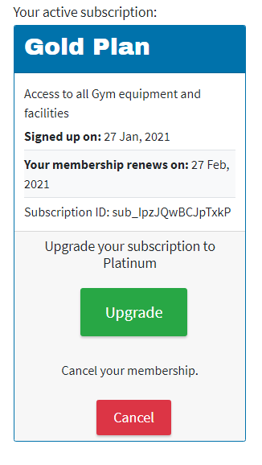
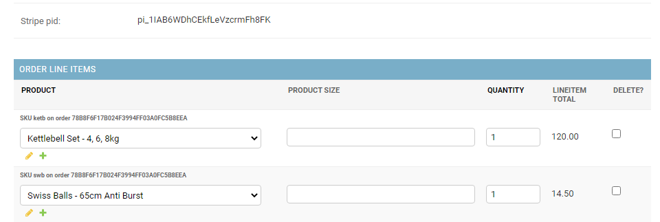
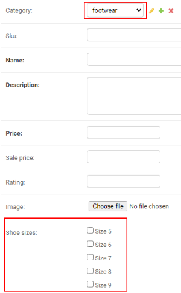

# Testing

## Table of Contents

1. [Validation](#validation)
2. [Colour Contrast Checking](#colour-constrast-checking)
3. [Automatic Testing](#automatic-testing)
4. [Manual Testing User Scenarios](#manual-testing-user-scenarios)
   - [Register for an Account](#register-for-an-account)
   - [Purchasing Products](#purchasing-products)
   - [Your profile](#check-your-profile)
   - [Product Reviews](#add-and-edit-a-product-review)
   - [Community Messages](#posting-messages-in-community)
   - [Sign up for Membership](#signing-up-for-a-membership-subscription)
   - [Test contact form](#test-contact-form)
   - [Staff Add/Edit Product](#add-a-product)
   - [Staff Add/Edit News Post](#add-a-news-post)
5. [Back-end Admin](#back-end-admin)

## Validation

### Python

I used the VS Code built in linter Flake8, as well as checking all the Python files (except core settings files) with [PEP8 Online](http://pep8online.com/).

The only outstanding issues are a few of lines that are slightly longer than the recommended length ( like in memberships app `client_reference_id=request.user.id if request.user.is_authenticated else None,`), because breaking them was proving difficult as it broke the functionality.

### HTML

I validated the rendered html of all pages with the [W3C Markup Validation Service](https://validator.w3.org/) and I had to deal with the following issues:

 - It showed me some errors like a wrong closing tags, closing tags in wrong places or missing, that certain attributes should not be on the iframes, duplicate ids in one page.
 - It recommended I removed the script 'text' attribute, as it is obsolete. 
 - I had to change a label's 'for' attribute (on quantity selector) as I was pointing to the input name and not the id.
 - On my custom product image upload widget there were duplicate ids on one input element. This was because the widget adds and id and class before rendering.
 - I had to remove a custom class that had been applied to the Product Form fields, as it was adding a second class attribute to the element.
 - On the add news page and edit news page I had forgotten to add an action value to the view. The form still worked probably because the same page's class based view handles GET and POST requests.
 - On the community topic view I had to add a dynamic id (with `{{ message.id }}`) to the delete modal so there were no repeating IDs, and do change the aria-labelledby attribute.

#### HTML Issues not corrected yet

There is one issue that has not been corrected yet.
The multiselect field used for the products sizes is showing an error with blank 'for' and 'class' attributes. This is being generated by the Multiselect Field add-on from the model, and to fix this I may need to customize the HTML of this widget in the form template, but time constraints prevented me from investigating and fixing this at the moment. It also does not impact the functioning of this section.

### CSS
I used the [Autoprefixer Tool](https://autoprefixer.github.io/) to apply browser prefixes.
I validated all the CSS files with the [W3 CSS Validation Service](https://jigsaw.w3.org/css-validator/) for CSS Level 3 + SVG and no errors were found, though it warned me about the vendor prefixes that the Autoprefixer had added.

### Javascript

I ran my javascript files through [JSHint](jshint.com). A few errors such as missing semi-colons were corrected, it mentioned about undefined variable $ and Stripe, but these are loaded separately, and notified of certain syntax that is only available from ES6.

## Colour Constrast Checking
I used [WebAIM's](https://webaim.org/resources/contrastchecker/) contrast checker to ensure that text on coloured backgrounds is readable and to WCAG AA Standard, especially white text on coloured backgrounds. Originally I had wanted white text on the orange buttons but the contrast was not enough so instead had to use a darker colour.

## Automatic Testing

I have written a number of tests (87) to test the key functionality of each app. These can be run with the command:

`python manage.py test`

Or to test an individual app:

`python manage.py test <appname>`

e.g. `python manage.py test pages`

### Coverage

I used [Coverage](https://pypi.org/project/coverage/) to help show how much of the project has unit testing completed. I found this was also useful for discovering a few minor bugs that I had not noticed during manual testing, such as incorrect messages being returned for product's quantity being updated. There are 87 tests and 83% of the project is tested.

Coverage can run all tests with the terminal command:

`coverage run --source=. manage.py test`

A coverage report can be viewed in the terminal with:

`coverage report`

Or a nicer way to browse a more detailed html version of the report is to run the command:

`coverage html`

This will create a folder in the project called 'htmlcov' which can be viewed in a browser, either by running `python3 -m http.server`, using your editor's Live Server extension and navigating to that folder in your project, or you could just find the htmlcov folder on your local computer filesystem and open the index.html file inside that folder.

I have detailed some of the automatic tests that are run on each app below. Expand the sections for more details.

  
<strong>Pages App</strong>

As most of these pages are just displaying content from a template, most tests are just to test that the pages load ok, or return a status code of 200.

There is a test for the homepage to test that the homepage uses the class HomePageView view.

The contact page has additional tests to test the form. There is a test to check that the contact page is using the ContactUsForm, and then 2 tests which test the form validation for blank fields, and submitting the form when required fields are filled in.

  
<strong>Products App</strong>

The tests for the products, check that the product page loads with status code of 200, and uses the products template. 

There are tests for the add products form. There is a test to check that the required fields return an error if the field is left blank and checks what the error message is.

There are tests for adding and editing reviews, making sure the user must be logged in to do that, and test that a user cannot edit other people's reviews.

  
<strong>Memberships App</strong>

The tests for the memberships tests that the membership dashboard returns the right status code and template when a user is logged in.

The success and cancel pages are tested for their status code.

  
<strong>News App</strong>

The tests for the news app test creating a new news post. There is some set up for the tests, a test user and a test post are created, and the tests check for the new post content, status code 200 and correct template for the news listings and news post detail page. There is a test for a 404 response from a non-existing news post.

  
<strong>Community App</strong>

The tests for the message board checks the status code of the page, that the /community/ url uses the correct view and that the Community Topics page contains an add_topic link. 

Then it tests creating a new news post. There is some set up for the tests, a test user and a test topic and post are created, and the tests check for the new post content, author and that the community_topics view returns status 200, checks it contains the test content, and uses the correct template.

  
<strong>Profile App</strong>

Tests for the profile app sets up a test user, then tests the profile view, status code and template used. There is also a test to check the string method returned is correct.

The EditUserProfile form is tested with a test user.

  
<strong>Checkout App</strong>

For the Checkout tests a test product is created, saved to the 'bag' session and then follows the checkout view to make sure the status code is 200 and the correct template is loaded.

Trying to checkout with an empty basket is tested and checks that the checkout view redirect to products and has an error message of 'There's nothing in your bag at the moment.' as per the view.

  
<strong>Bag App</strong>

The tests for the bag app include checking the status response and template, testing adding a Test Product to the bag and check the messages returned matches the expected message, testing updating the quantity of an item and deleting an item. This does not yet include testing different sizes.

### Google Lighthouse Testing

I tested the Heroku deployed site with Lighthouse and got the following scores on desktop:

The Perfomance and Best Practices drop to 70 and 86 respectively for mobile, yet the Accessibility increased to 96:

### Testing on Browsers, Screen sizes and Devices

As well as testing with Dev Tools responsive views, I tested the website on the following browsers and devices:
- Chrome on PC and Mac
- Firefox on PC and Mac
- Safari on Mac
- Microsoft Edge V44
- Chrome on Samsung Galaxy S8, Android V9
- Firefox on Samsung Galaxy S8
- Native Browser on Samsung Galaxy S8
- Chrome on Lenovo 10" Tablet, Android V6

Compatability was very good across all devices and responded as I intended.

#### Testing other devices

I ran the website through [Browser Stack](https://www.browserstack.com/) on a free account to test on real devices and screen sizes. This is not easy on the free (test) plan as it only gives you 1 minute per device, and it's also not so easy to zoom as on an actual device in your hand. I was able to live test the homepage, News pages, adding products to the bag, editing the bag, and testing the contact form fields are required on the following devices:

 - Samsung Galaxy S10, Chrome
 - Samsung Galaxy S20+, Chrome
 - iPhone X, Safari
 - iPhone 8, Safari
 - iPad Pro 11 2018, Safari
 - iPad 7th, Safari
 - Google Pixel 4, Chrome
 - Motorola, Moto G 2nd Gen

Again, compatability was very good across all devices, and worked and responded as I intended.

## Manual Testing User Scenarios

I also extensively manually tested all functionality of the site. The following steps can be used to test the site manually.

### Register for an Account

Users do not need to create an account to purchase products but there are other options to be tested for logged in users, so first register by clicking on Your Account in the top right. The register page is displayed. All fields are required, and forgetting to fill a field prompts you to check the field:

Once registration is successfully submitted you will be notified that an email has been sent to you for verification. You can either click on the link (if your email client has automatically created a hyperlink) or copy the confirmation link and paste it into your browser. There you will be asked to confirm the email address. Clicking confirm, confirms the address and you can now login with the Username and Passsword you just created.

Users are also given the option to register or login upon checkout if they are not currently logged in.

### Purchasing Products

Click on Products > All Products in the navigation menu. Different categories can be filtered for by selecting them in the dropdown.

From the list of products click 'View Detail' button on a product. This goes to the product detail page. Click 'Add to bag' to put the item in the shopping bag. Repeat this for another product that has sizes (clothing or footwear), but also select the size and set quantity to a higher number like 3. Now the product and their quantity are in the bag.

Click 'Edit bag' in the notification, or click the bag icon to be taken to the shopping bag page.

On the shopping bag page, increase or decrease the quantity and press 'Update' to change the item's quantity.

A notification shows the change in the bag.

On one of the products click the Delete/Trashcan icon. The product will be removed from the bag. 

Now click on 'Secure Checkout'. This goes to the checkout page, where you can enter your name and delivery details. Your user email address is already in place. Make sure the 'Save delivery information to profile' box is checked.

The site does not take real payments so we need to use a test stripe card for the credit card details.

Use '4242 4242 4242 4242' for the card number, any future date, any 3 numbers for CVC and any 5 numbers for ZIP:

Click on 'Complete Order' button. The order will be processed and you will be presented with the confimation page. An email will be sent with the order information.

### Check your profile

To check your order history and default delivery information go to 'Your Account' > 'Your Profile' from the top navigation bar. The delivery information has been saved and the order is now in the Order History. Click the order number to view the order details again.

You can also change some details on the delivery information and click 'Update Information' and the new information will be saved to your profile.

### Add and Edit a Product review

Now that you have a user profile you can leave a review of a product. Go to any product's detail page and below the product information click 'Review this product' button. You are taken to a page with a simple form for leaving a review, where you can leave a review title and the review itself. Click 'Add Review' and the review will be added to the product. Now when you look below the Reviews you will see your new review:

#### Edit a review
As you may have numerous reviews and instead of having to search each individual product for your reviews, you can see all your reviews under your profile. Go to 'Your Account' > 'Your Profile' from the top navigation bar. Below your information and order history you will see your product reviews. It shows the review title and product it reviews. You can click the product name to go to that product, or click the 'Edit your review' button or 'Delete This Review' button to edit or delete the review.

#### Try to edit another User's review

When you go to edit your review, you can see in the address bar the id of the review, like `/products/edit_review/5/`. A savy user might try to edit a different review by changing the number here. I know review 1 belongs to a different user. Change this number in the address bar to 1, so it reads `/products/edit_review/1/` and hit enter. You will be returned to the profile page with the error notification 'You cannot edit other people's reviews' popping up.

The same thing will happen if you try to delete another user's review in a similar fashion. When you click 'Delete' there is a pop-up warning you are about to delete this review. Hovering over the pop-up 'Delete' button allows you to see and copy (right-click and Copy link address) the url for the deletion of a review. It will be like `https://power-fitness.herokuapp.com/products/delete_review/5/`. If you paste this into the address bar and change the `/5/` to `/1/` and hit enter, you are returned to the profile page with the notification "You cannot delete other people's reviews!".

If you try to edit or delete a non existing review id, there will be a 404 page not found.

### Posting Messages in Community

The community section allows logged in users to post Topics and Messages to the message board. Click on Community in the navigation menu. You are brought to the topics overview, where you can see a list of topics, who started them, the number of messages in a topic and the date and time of the last message.

When viewing a topic's messages you can post a reply. Click the large 'Post a reply' button at the top of the messages list to add a message. On the reply page you can write in the message box at the top, and can also see the list of messages in the topic below for reference. Write a message and click 'Reply to Topic' button.

You are returned to the topic messages and your message appears at the bottom. You will notice that you have the option to Edit or Delete your message but not other user's messages:

Deleting the message, will remove the message and a Success notification confirms this.

#### Try to edit another User's message

When you go to edit your message, you can see in the address bar the id of the topic and post, like `/topic/1/edit_post/21/`. Again, a savy user might think they can edit a different message by changing the number here. Change this number in the address bar to 1, so it reads `/topic/1/edit_post/1/` and hit enter. You will be returned to the topic page with the error notification 'This is not your post, you cannot edit it.' popping up.

The same thing will happen if you try to delete another user's message in a similar fashion, as was detailed under reviews above. 

If you try to edit or delete a non existing message id, there will be a 404 page not found.

#### Adding a new Topic

From the community page (where you can see all the topics), it is possible to start a new topic by clicking 'Add new topic' button. You are then presented with a page with a form for adding your topic subject and also the first message for the topic.

### Signing up for a Membership subscription

The point of the membership subscription section is to allow users to subscribe to one of 2 gym memberships, Gold or Platinum. Then the user can have access to the gym, and if they choose the Platinum membership they will get more benefits like workout and nutrition plans. Obviously the gym would need to be a physical location and there would need to be administration done on the gym's side to allow a new user access to such a location, but this site provides a mechanism for users to sign up online and monthly payments to the gym would be handled by Stripe.

Click Memberships in the navigation menu, and you are brought to a public page with the details of both available membership plans. To actually subscribe to a membership a user must be registered. Click the 'Become a Member' button. 

If you are not registered you will be asked to sign in or register. Once logged, click the 'Become a Member' button or under 'Your Account' click 'View Membership' and you are brought to a page that shows membership details if you have already subscribed, or the 2 options to subscribe to if you have no current membership.

Click on the 'Subscribe' button within the Gold Membership option.

You are brought to a Stripe payment page, which shows the cost per month and card fields needed to subscribe. Fill in the fields with your email, test credit card details, again use '4242 4242 4242 4242' for the card number, any future date, any 3 numbers for CVC.

Click the 'Subscribe' button. After a few moments you will be returned to the Power Fitness website, where your should see your subscription was successful.

Clicking on the 'Return to membership dashboard' link will return to the membership page but now you can see the details of the plan you just signed up for, including the date you signed up and the next renewal date.

#### Upgrade your membership

When on a Gold Plan there is an option to Upgrade to the Platinum Plan. Click on the green 'Upgrade' button. A pop-up warns of the changes to the plan, with an option to cancel. To upgrade, click the 'Upgrade Membership' button. You will be notified that the Upgrade was successful.

Now when you return to the membership dashboard, the plan has changed to Platinum, and below the plan, there are workout and nutrition plans and a classes timetable available for download which are only available for Platinum members.

The documents for download here only contain dummy content for the purposes of illustration.

#### Cancel your membership

From the membership dashboard you can also cancel your plan and will no longer be charged the monthly fee. Click the red 'Cancel' button in the plan details to cancel it. A pop-up warns of the cancellation to the plan, with an option to Not Cancel. To cancel, click the 'Cancel Membership' button. You will be notified that your membership was cancelled.

### Test Contact Form

Click Contact in the navigation menu. There is a form for submitting a message to the gym. Required fields are marked with *. If any of these fields are left blank the form will not be submitted and the user will get a message on the field "Please fill in this field."

With all required fields filled and using a real email address, click the 'Submit Message'. The form is submitted via ajax, and after a few seconds a notification appears on screen letting the user know their message has been submitted. The form fields are also cleared.

If you used a real email address you should also get an email thanking you for your submission. The site admin will also get an email notifying them of the submitted message, and the submissions are also stored in the back-end admin. See the [section below](#manage-contact-form-submissions) for how admin can manage submissions in the back-end.

#### Test Contact Form without Javascript

As the contact form submission relies on ajax, I also wanted a fall-back in case there were Javascript issues that prevent it from working. So the view will handle submissions if Javascript is not enabled. 

This can be tested by disabling Javascript using [Chrome dev tools](https://developers.google.com/web/tools/chrome-devtools/javascript/disable) or a browser extension like Web Developer by Chris Pederick. Then navigate to the contact page again and submit the form. The page will reload and the form has been submitted. The same confirmation emails will be sent to the user and admin. The submission is also saved in the Django admin.

Remember to re-enable Javascript after testing this.

### Front-end Staff Admin

Staff members can be created that allows them to login on the front-end of the site, and gives them additional authorisation to create, edit or delete products, and create, edit or delete news posts. Staff could also be allowed back-end access if required.

The following test staff user can be used to test this:

- Username: Power-Fitness-Staff
- Password: 

#### Add a Product

When logged in as staff member, now under 'Your Account' there are additional options, 'Add a Product', 'Create News Post' and 'View News Drafts'. Click on 'Add a Product'.

This takes you to a page with a form for adding a new product. The first field is the Category for the product to go into. Note here that selecting 'Clothing' or 'Footwear' will display Clothing Sizes or Shoes Sizes at the bottom of the form.

If a different category is selected then there are no size options. You can also see that only Name, Description and Price are required and are denoted by the *. Fill in all the fields including the Sale Price (lower than the price typically) and select an image for the product image. Click the 'Add Product' button at the bottom. The product will be added and you are taken to the new product's details page.

If you added a sale price you will see the original price is greyed and struck out, and the sale price highlighted with a yellow background. Because you are logged in as staff there are also options for editing and deleting this product.

#### Edit a Product

Click the 'Edit Product' button, and make changes to the new product. In this example I will switch the category to footwear and add available sizes. Now click 'Update Product'. Now the changes are visible on the product detail page, along with the new Select Shoe Size options.

#### Delete a Product

From the new product's detail page, now click 'Delete Product'. A pop-up will check that you do in fact want to delete this product. Click 'Delete' and the product will be deleted, and you will be returned to the products page and notified that this was successful.

#### Add a News Post

When logged in as staff member, under 'Your Account' there are additional options, 'Add a Product', 'Create News Post' and 'View News Drafts'. Click on 'Create News Post'. This takes you to a page with a form for adding a new news post. Fill in the required fields and select the Status field as 'Draft'. Then click 'Add news post'. This adds the post as a draft and takes you to the detail view of this post. The post will be labelled draft, and there are options to edit or delete the post.

#### Edit a News Post

If you click on News in the navigation menu, you will see that the draft news post does not appear in the news list. Click on 'Your Account' and 'View News Drafts' and you will see the draft just created here. Click on 'Edit' under the draft news post and you will be brought to the edit news post page. Edit some content and set the 'Status' field to Published and click the 'Update news post' button. The post is published and you are taken to the post detail page. Now if you click 'News' you will see the new news post at the top of the list. If you then click 'Your Account' > 'View News Drafts', you will see the draft is gone, and if there are no other drafts it will say "There are currently no drafts".

#### Delete a News Post

Click on News in the navigation and click on your new news post title or 'Read more' button. From the post detail page there is the option to delete this new post. You could also edit and set the status back to 'Draft' to remove it from the News listings. But if you click 'Delete', a pop-up will check that you do in fact want to delete this post. Click 'Yes, Delete news post' and the news post will be deleted, and you will be returned to the latest news page.

#### News Pagination

There is pagination on the Latest News posts so that this page does not get too long. It will only show the latest 3 posts and the pagination appears below that to allow you advance to the next page. You can also skip to the last or first page depending on your position in the pages.

#### Test Forbidden 403 Access to new news posts

If logged in as staff or super user you can obviously add, edit and delete news posts. If you are just logged in as a normal registered user you cannot access these. This can be tested by logging in as a normal registered user and trying to go to the url for adding a new post (https://power-fitness.herokuapp.com/news/new/). You will se you are not allowed to do that and the 403 template is rendered with a short message about why.

### Back-end Admin

All the user generated content can be edited from the Django Admin, such as Products, Community Messages and Contact Form submissions. This is to allow the admin full control over all content. A few points of note are as follows:

#### Manage Contact Form Submissions

Under the Pages app the admin can view contact form submissions. They cannot change the submitted content but they can mark a submission as 'Answered', so they can track what submissions have been responded to. This can be viewed from the list of submissions:

And can be marked as answered by editing the submission and checking the 'Answered' box at the top:

#### Product Orders and Line items

When viewing an individual order, the items order will appear at the bottom of the order page.

#### Product Reviews

There are a couple of ways to view the product reviews. The admin can go to Products > Reviews and see a list of all reviews. THey can see from the list who the reviewer was and what product the review is for.

Also when editing a product the admin can see a list of the reviews for this product at the bottom of the page.

#### Adding Product in back-end

The Admin can add a product as expected, but there is also some Javascript on this page that controls the hiding and showing of clothing and shoe sizes depending on the category selected. This is to mimic what happens on the front-end.

### Testing Save info in webhook handler
I commented out the form.submit() action in the checkout app's stripe_elements javascript file and placed an order with the save info box checked, while changing some profile information. This breaks the normal payment process (as the form is not submitted) and the fallback relies on the webhook handler to save the information. Checking the payments in Stripe dashboard shows the payment still succeeded. Then checking the orders in the site admin shows that the order was created and the profile details updated. Also, by checking the site front-end user profile, it shows that the order succeeded and the details were updated. Finally, going to the checkout page again with the same user shows their pre-filled details have been updated too.

# Issues I had to overcome

## Allowing admin to set sizes
I wanted the admin to be able to set different sizes on clothing and shoes, and the shoe sizes would be different from the clothing sizes. I tried using django's built in CharField choices, but this only allowed you select 1 from a dropdown list, where I needed to be able to set multiple sizes for a product. So I used the Django [MultiSelectField package](https://pypi.org/project/django-multiselectfield/). This allows the admin to select multiple options (set in the product model) in the form of checkboxes.

## Getting multiple sizes to work in the bag app
I was able to get a single size attribute (e.g. shoe size) to be stored in the shopping bag session and listed in the bag page. But it proved more difficult to also get the clothing sizes to be stored. At first I tried just duplicating what I had done for the shoe sizes and checking for the clothing size. I had it that the bag app was assuming that if the item's dictionary value was not an integer, then look for the value of the shoe sizes or clothing size. But I was getting a KeyError for the clothing key. Finally I realised that the program was trying to get the shoe size and clothing size for all items, which of course is not possible. I needed to check which it was.

So in the view, I had to check did shoe or clothing size exist in the POST object, check which one it was and then add (or increment) the item to the bag session. In the bag context file, I commented out the erroring code and worked out some simple if statements, so if the specific size key is in the bag item, print out what size is present and the value. I could see the dictionary that was being printed out and used [JSON Formatter](https://jsonformatter.org/) to view the structure clearer. This helped me determine how to access the correct key, value pairs. Once that was working I could place the code for adding the items to the bag within the 'if key' structure.

## Unable to get Stripe CLI to run
For testing locally, Stripe recommends using Stripe CLI for testing webhook responses. But following installation instructions for Windows the program would just not run on my computer. If I tried running the .exe file it would open and then just close immediately (both 32 bit and 64 bit). I tried running it from the terminal, command line, moving the .exe file in to my project folder, my virtual environment, but nothing worked and I was unable to use the 'stripe login' command. Luckily the Ngrok program did work for me and allowed me to test webhooks in local development, but I had to manually create webhooks in the Stripe dashboard for the url that ngrok provided for me.

## Get return domain url for Stripe Subscriptions Checkout
I tried to get the return domain_url from the create_checkout_session view using the build_absolute_uri method and splitting it, in order to not have to set the variable DOMAIN_URL in settings. This worked locally, but testing in the likes of Gitpod only returned http://locahost:8000/ probably because of a proxy server, so this is not likely to work in all situations. I decided to leave the DOMAIN_URL as a setting to be changed upon deployment and made a note about it under the deployment section in the readme file.

## Sending different Subscription Plan Prices
When I got one Subscription Plan set up and working, I wanted to add another plan as an option for customers to sign up to. I obviously wanted to not have to repeat the code in the create_checkout_session view, which at that point was getting the Stripe Price Id from the settings. I wanted it to work so that the button clicked (on memberships page) would send the price to the view. 

I tried using JavaScript's Fetch api and sending the price_id, gotten from button's data attribute, via Fetch's POST method to the view but this required a POST method in the create_checkout_session view. I set up an `if request.method == 'POST'` and was able to get the price_id sent from the button by JavaScript. But I then realised I could not get the data/variable from the POST request to the GET request. It would also have caused a problem with the @csrf_excempt decorator on the view, as it would now require a csrf token. 

So I had to think then if I cannot do it server side, then maybe Javascript can work out the correct price_id before it is retrieved by the create_checkout_session. At first I was thinking I could put it in the url as a parameter and get it from the view. But then I was thinking about how views pass data to each other and could I pass the variable through the fetch url. After some research this [question on stack overflow](https://stackoverflow.com/questions/50983150/how-to-pass-a-variable-with-url-on-javascript-fetch-method) suggested that a variable can be passed with Fetch by using template literals (or back-ticks). So I just needed to adjust my create_checkout_session view and url to look for a price_id and use that as my stripe price_id. Once I had a different event listener for each button, this worked so depending on which button was clicked, the subscription price would be different.

## The community message board Edit Post urls
When viewing a topic I have the url as something like `/community/topic/1/`. THe number is the topic id. But to allow the user to edit a message they have already posted, I first tried with just the url as `edit_post/1/`. This allowed me to edit the message but then I could not return the user to that topic because the view_topic view required a topic id. Also the url was not consistent, as it did not have `community/topic/` in it. I did not know if I could even pass the topic id as well as the message id through the template tag.
But through trial an error I figured out how to do that and was able to get my edit message url to look like `community/topic/1/edit_post/6/` and return the user to the topic page.

## Delete News Post without needing the confirmation template
When using class based views for the news section I wanted to delete a post without needing the default _confirm_delete template, so it would match with how other items on the site are deleted, with a pop-up warning. - This post on [stackoverflow](https://stackoverflow.com/questions/17475324/django-deleteview-without-confirmation-template) helped me understand how to skip the _confirm_delete template when using DeleteView in a class based view.

## Using slugs instead of ids in news posts urls
I have news posts in my project, and I had it all working (CRUD), but I wanted to change the url to use a slug based on the page title instead of just an id like /news/1/, as having numbers in a url is very dated. I had auto generation of the slug from the title working and could view the news post using the slug, but for some reason when I went to create a new post (front-end) I got a 404 page not found error, even though the slug url was only used when viewing the post detail. The id or slug is not passed to the NewsPostCreateView so I don't know why that happens. If I change the url for the NewsPostDetailView view to use <int:pk> instead of <slug:slug>, everything works fine. But for some reason the slug affects the NewsPostCreateView. There were no other errors in the terminal and I was unable to find an answer for this in a reasonable time, so due to time constraints had to move on so have just reverted to use the <int:pk>. I have left the slug field in the model in case I have time to revisit this again later.

## Getting jQuery to work in the Django Admin
I wanted to add JavaScript to the Django admin so I could hide the shoe or clothing sizes options depending on the category selected in the add product page. Following 1 article [here](https://stackoverflow.com/questions/15978719/django-admin-show-field-only-if-checkbox-is-false) and the [django docs](https://docs.djangoproject.com/en/3.1/topics/forms/media/#media-objects), showed how to load the JavaScript file, and it was loading because I could get a console.log to show on the page. But it would not select the element and instead was showing an `Uncaught TypeError: $ is not a function`. It seemed that jQuery was not loaded before my script file. I wanted to use jQuery because I had used it quite simply on the front-end Add Product page, and did not want to have to re-write the same in native JavaScript. So I finally found something that worked, this [Stack Overflow question](https://stackoverflow.com/questions/58087470/django-jquery-is-not-a-function-message) showed how to not fire your JavaScript until Django's jQuery was defined.

## Allowing Staff Access to Class based views

When testing if a staff user (non-admin) can create, edit or delete news posts, I discovered that I was getting the 403 Forbidden message. I had been testing these News class based views using my full admin super user previously and had the permission required to do so. I had just been using the `PermissionRequiredMixin` with `permission_required = 'user.is_staff'`, but this did not actually work for staff users. From this [Stack Overflow article](https://stackoverflow.com/questions/51284583/authentication-for-class-based-views-in-django) I learned a way to make your own mixin to test for is_staff, and using that on the required views.

# Oustanding Bugs

## Bag items show in toast notification when logging in

If you have an item in the bag when you are doing something that sends another success message, like logging in or editing a product, the notification toast shows the contents of the bag as well as the success message. I would prefer the bag does not show when these type of events occur.

## Adding an already existing Community Message Board Topic

When adding a Community topic, if the topic exists, it will create another topic assigned to this user, but all messages from the first topic of the same name will appear here too. I tried adding a `unique=True` constraint to the MessageTopic model subject field but the migration would not work, and errored saying `UNIQUE constraint failed:`. So for now I have left this as it is as it does not error or fail, just duplicates the Topic.